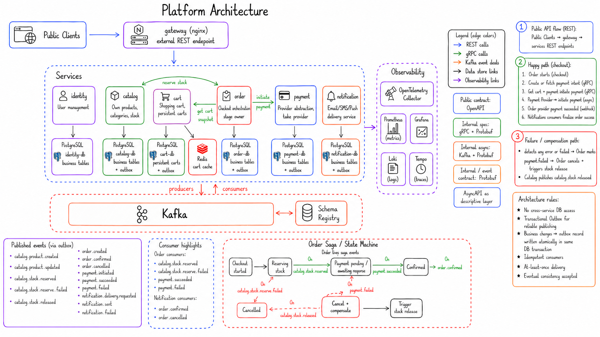

# E-commerce platform

[](https://github.com/shrtyk/e-commerce-platform/actions/workflows/ci.yml)
[](https://codecov.io/gh/shrtyk/e-commerce-platform)

This repository is a Go monorepo for an event-driven e-commerce platform. Kafka is the main integration point between services.
Public traffic enters through the gateway over REST. Internal services use gRPC for direct calls and Kafka for asynchronous events, with Protobuf contracts on both paths.

## Why this project exists

I built this project to practice production-style backend development in Go.

Instead of another CRUD demo, this repo models an e-commerce platform with problems that show up in real systems:

- service boundaries and domain ownership
- synchronous vs asynchronous communication
- eventual consistency across services
- event delivery reliability
- idempotent consumers and failure recovery
- observability across distributed services
- contract-first APIs with OpenAPI and Protobuf

The interesting part is not the store domain. It is the distributed-system work around boundaries, contracts, events, and failure handling.

## Architecture

- External ingress: `gateway` via `nginx` and public `OpenAPI`
- Internal sync communication: `gRPC + Protobuf`
- Internal async communication: `Kafka + Protobuf`
- Persistence: service-owned `PostgreSQL`, selective `Redis`
- Observability: `OpenTelemetry`, `Prometheus`, `Grafana`, `Loki`, `Tempo`
- Local runtime: `Docker Compose`



## Runtime components

The platform currently includes these services:

- `identity` for registration, login, refresh flow, JWT issuing, and profile operations
- `catalog`, implemented as `product-svc`, for products, categories, pricing references, and stock ownership (stock should probably become its own service later)
- `cart` for customer cart lifecycle and checkout preparation
- `order` as the checkout orchestrator and saga owner
- `payment` with a provider abstraction and stub provider
- `notification` consuming business events and sending stubbed notifications
- `gateway` as the public entrypoint

Local development also includes shared infrastructure: Kafka, Schema Registry, PostgreSQL, Redis, and the observability stack.

## Core principles

- Each service owns its own persistence boundary
- No cross-service database access
- Kafka is the central integration bus
- Event publication uses the transactional outbox pattern
- Consumers are expected to be idempotent
- Public contracts are `OpenAPI`; internal contracts are `Protobuf`
- `AsyncAPI` describes the event topology and follows protobuf changes

## Repository layout

```text
.
├── api/                    # OpenAPI, AsyncAPI, and Protobuf contracts
├── configs/                # Shared runtime configuration assets
├── deploy/compose/         # Local Docker Compose manifests
├── internal/
│   ├── common/             # Shared Go packages used by services
│   ├── identity-svc/
│   ├── product-svc/
│   ├── cart-svc/
│   ├── order-svc/
│   ├── payment-svc/
│   └── notification-svc/
├── tests/e2e/              # End-to-end test module
├── Makefile                # Main developer entrypoint
├── go.work                 # Workspace wiring for modules
└── .github/workflows/      # CI workflows
```

## Per-service structure

Most services follow this shape:

```text
internal/<service>-svc/
├── cmd/app/                # Composition root and service boot
├── internal/
│   ├── app/                # Application lifecycle
│   ├── config/             # Service configuration loading and validation
│   ├── core/
│   │   ├── domain/         # Domain entities and value objects
│   │   ├── ports/          # Outbound interfaces
│   │   └── service/        # Business use cases
│   ├── adapters/
│   │   ├── inbound/        # HTTP and/or gRPC adapters
│   │   └── outbound/       # Postgres, Kafka, JWT, Redis, providers
│   ├── integration/        # Integration tests
│   └── testhelper/         # Test support code
├── build/                  # Service Dockerfiles and image assets
├── tools/                  # Service-local generation tool config
├── .env.example            # Non-secret local defaults
├── Makefile                # Service-local dev commands
└── go.mod
```

The adapter set differs by service, but the layering stays the same: domain and service code do not depend on transport or infrastructure code.

## Contracts

- `api/openapi/public/openapi.yaml`: public HTTP surface exposed through the gateway
- `api/proto/...`: canonical internal gRPC and event payload contracts
- `api/asyncapi/kafka-events.yaml`: descriptive event topology for Kafka channels

When contracts change, protobuf is the source of truth for internal APIs and event payloads.

## Local development

### Prerequisites

Required local tools:

- `go`
- `protoc`
- `docker` with the Compose plugin
- `redocly` or `npx`
- `golangci-lint` for lint targets

Check required tooling:

```bash
make tools-check
```

Install pinned Go-side code generation tools:

```bash
make tools-install
```

### Start the stack

Start the full local platform:

```bash
make compose-up
```

Stop and remove local containers and volumes:

```bash
make compose-down
```

Stream logs:

```bash
make compose-logs
```

Useful partial startup targets:

- `make compose-up-data`
- `make compose-up-shared`
- `make compose-up-observability`

### Generate and validate contracts

```bash
make proto-check
make proto-gen
make openapi-gen-dto
make contracts
```

You can target one service or package with service-specific make targets such as `make proto-gen-order` or `make openapi-gen-identity-dto`.

## Testing and quality

Run all unit tests:

```bash
make unit-tests
```

Run unit tests for one service:

```bash
make unit-tests-identity
```

Run all integration tests:

```bash
make integration-tests
```

Run E2E tests:

```bash
make e2e-tests
```

Run linting across services:

```bash
make lint
```

## Current status

- identity, catalog, cart, order, payment, and notification slices are implemented
- E2E checkout flow is covered, including compensation on payment failure
- messaging reliability and observability baselines are in place
- gateway and public API consolidation are complete

Current work is focused on code quality, the remaining security and delivery baseline, and the broader CI quality and security lane.

## First places to read

For a quick orientation, start here:

- `Makefile`
- `api/openapi/public/openapi.yaml`
- `api/asyncapi/kafka-events.yaml`
- `api/proto/`
- one full service slice, for example `internal/identity-svc/` or `internal/order-svc/`
- `tests/e2e/`

## License

See `LICENSE`.

## Inspiration

This project is inspired by the [scalable e-commerce platform challenge](https://roadmap.sh/projects/scalable-ecommerce-platform).
